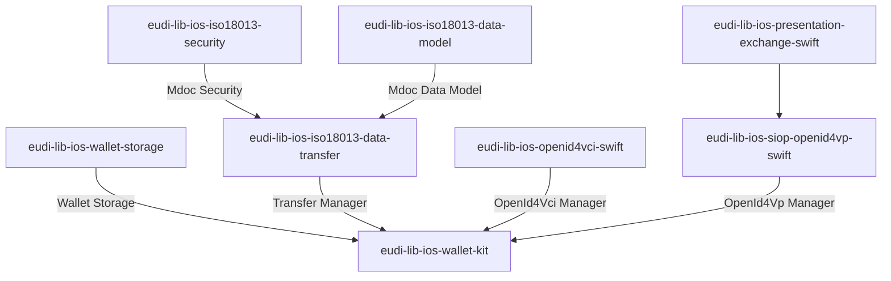

# EUDI Wallet Kit library for iOS

**Important!** Before you proceed, please read
the [EUDI Wallet Reference Implementation project description](https://github.com/eu-digital-identity-wallet/.github/blob/main/profile/reference-implementation.md)

----

# EUDI ISO iOS Wallet Kit library
[](https://www.apache.org/licenses/LICENSE-2.0)
[](https://github.com/eu-digital-identity-wallet/eudi-lib-ios-wallet-kit/actions/workflows/swift.yml)
[](https://sonarcloud.io/summary/new_code?id=eu-digital-identity-wallet_eudi-lib-ios-wallet-kit)
[](https://sonarcloud.io/summary/new_code?id=eu-digital-identity-wallet_eudi-lib-ios-wallet-kit)
[](https://sonarcloud.io/summary/new_code?id=eu-digital-identity-wallet_eudi-lib-ios-wallet-kit)
[](https://sonarcloud.io/summary/new_code?id=eu-digital-identity-wallet_eudi-lib-ios-wallet-kit)

## Overview

This repository contains the EUDI Wallet Kit library for iOS. The library is a part
of the EUDI Wallet Reference Implementation project.

This library acts as a coordinator by orchestrating the various components that are
required to implement the EUDI Wallet functionality. On top of that, it provides a simplified API
that can be used by the application to implement the EUDI Wallet functionality.



The library provides the following functionality:

- Document management
    - [x] Storage encryption
    - [x] Using iOS Secure Enclave for generating/storing documents' keypair
    - [x] Enforcing device user authentication when retrieving documents' private keys
- Document issuance
    - [x] Support
      for [OpenId4VCI (1.0)](https://openid.net/specs/openid-4-verifiable-credential-issuance-1_0.html)
      document issuance
        - [x] Authorization Code Flow
        - [x] Pre-authorization Code Flow
        - [x] Support for mso_mdoc format
        - [x] Support for sd-jwt-vc format
            - [x] Support credential offer
            - [x] Support for DPoP JWT in authorization
        - [x] Support for JWT proof types
        - [x] Support for deferred issuing
        - [x] Support for batch issuing
- Proximity document presentation
    - [x] Support for ISO-18013-5 device retrieval
        - [x] QR device engagement
        - [x] BLE data transfer
- Remote document presentation
    - [x] [OpenId4VP (1.0)](https://openid.net/specs/openid-4-verifiable-presentations-1_0.html)
      document transfer
        - [x] ClienID scheme: preregistered, x509_san_uri, x509_san_dns, redirect_uri
        - [x] DCQL

The library is written in Swift and is compatible with iOS 16 or higher. It is distributed as a Swift package
and can be included in any iOS project.

It is based on the following specifications:
- ISO/IEC 18013-5 – Published
- Presentation Exchange v2.0.0 - Published
- [OpenID4VP – 1.0](https://openid.net/specs/openid-4-verifiable-presentations-1_0.html)
- [SIOPv2 – Draft 13](https://openid.net/specs/openid-connect-self-issued-v2-1_0.html)
- [OpenID4VCI – 1.0](https://openid.net/specs/openid-4-verifiable-credential-issuance-1_0.html)

### Disclaimer
The released software is a initial development release version: 
-  The initial development release is an early endeavor reflecting the efforts of a short timeboxed period, and by no means can be considered as the final product.  
-  The initial development release may be changed substantially over time, might introduce new features but also may change or remove existing ones, potentially breaking compatibility with your existing code.
-  The initial development release is limited in functional scope.
-  The initial development release may contain errors or design flaws and other problems that could cause system or other failures and data loss.
-  The initial development release has reduced security, privacy, availability, and reliability standards relative to future releases. This could make the software slower, less reliable, or more vulnerable to attacks than mature software.
-  The initial development release is not yet comprehensively documented. 
-  Users of the software must perform sufficient engineering and additional testing in order to properly evaluate their application and determine whether any of the open-sourced components is suitable for use in that application.
-  We strongly recommend to not put this version of the software into production use.
-  Only the latest version of the software will be supported

## Installation
To use EUDI Wallet Kit, add the following dependency to your Package.swift:
```swift
dependencies: [
    .package(url: "https://github.com/eu-digital-identity-wallet/eudi-lib-ios-wallet-kit.git", .upToNextMajor(from: "0.16.4"))
]
```

Then add the Eudi Wallet package to your target's dependencies:
```swift
dependencies: [
    .product(name: "EudiWalletKit", package: "eudi-lib-ios-wallet-kit"),
]
```
## Reference
Detailed documentation is provided in the DocC documentation [here](https://eu-digital-identity-wallet.github.io/eudi-lib-ios-wallet-kit/documentation/eudiwalletkit/)

## Initialization
The [EudiWallet](https://eu-digital-identity-wallet.github.io/eudi-lib-ios-wallet-kit/documentation/eudiwalletkit/eudiwallet) class provides a unified API for the two user attestation presentation flows. It is initialized with a document storage manager instance. For SwiftUI apps, the wallet instance can be added as an ``environmentObject`` to be accessible from all views. A KeyChain implementation of document storage is available.

The wallet developer can customize cryptographic key operations by passing `SecureArea` instances to the wallet, otherwise the wallet-kit creates 'SecureEnclave' (default) and 'Software' secure areas. The wallet developer can specify key create options per doc-type such as curve type, secure area name, and key unlock policy.

```swift
let wallet = try! EudiWallet(serviceName: "my_wallet_app",
   trustedReaderCertificates: [Data(name: "eudi_pid_issuer_ut", ext: "der")!] )
```

### OpenID4VCI Configuration

The wallet now supports multiple OpenID4VCI issuer configurations for enhanced flexibility. You can configure the wallet with a dictionary of issuer configurations:

```swift
// Configure multiple OpenID4VCI issuers with DPoP support
let issuerConfigurations: [String: OpenId4VciConfiguration] = [
    "eudi_pid_issuer": OpenId4VciConfiguration(
        credentialIssuerURL: "https://pid.issuer.example.com",
        useDpopIfSupported: true,
        dpopKeyOptions: KeyOptions(
            secureAreaName: "SecureEnclave", curve: .P256, accessControl: .requireUserPresence
        )
    ),
    "mdl_issuer": OpenId4VciConfiguration(
        credentialIssuerURL: "https://mdl.issuer.example.com",
        useDpopIfSupported: false
    )
]

let wallet = try! EudiWallet(
    serviceName: "my_wallet_app",
    trustedReaderCertificates: [Data(name: "eudi_pid_issuer_ut", ext: "der")!],
    openID4VciConfigurations: issuerConfigurations
)

// Register additional issuers after initialization
try wallet.registerOpenId4VciServices([
    "new_issuer": OpenId4VciConfiguration(credentialIssuerURL: "https://new.issuer.com")
])
```

The `useDpopIfSupported` property controls whether to use DPoP when the issuer supports it. The `dpopKeyOptions` property allows you to specify key generation parameters for DPoP keys, including the secure area, curve type and user authentication options.	


## Manage documents

The [EudiWallet](https://eu-digital-identity-wallet.github.io/eudi-lib-ios-wallet-kit/documentation/eudiwalletkit/eudiwallet) class provides a set of methods to work with documents.

### Loading documents

The `loadDocuments` method returns documents with a specific status from storage.

The following example shows how to retrieve issued documents:

```swift
 public func loadDocuments() async throws {
    let documents = try await wallet.loadDocuments(status: .issued)
  }
```

To retrieve documents of all statuses use the `loadAllDocuments` method.

```swift
let documents = try await wallet.loadAllDocuments()
```

The `loadDocument(id:status:)` method returns a document with a given id and status. 

The following example shows how to retrieve a document:

```swift
let document = try await wallet.loadDocument(id: documentId, status: .issued)
```

### Storage manager
The read-only property ``storage`` is an instance of a [StorageManager](https://eu-digital-identity-wallet.github.io/eudi-lib-ios-wallet-kit/documentation/eudiwalletkit/storagemanager) class.
Currently the keychain implementation is used. It provides document management functionality using the iOS KeyChain.

The storage model provides the following models for the supported well-known document types:

|DocType|Model|
|-------|-----|
|eu.europa.ec.eudiw.pid.1|[EuPidModel](https://eu-digital-identity-wallet.github.io/eudi-lib-ios-iso18013-data-model/documentation/mdocdatamodel18013/eupidmodel)|
|org.iso.18013.5.1.mDL|[IsoMdlModel](https://eu-digital-identity-wallet.github.io/eudi-lib-ios-iso18013-data-model/documentation/mdocdatamodel18013/isomdlmodel)|

Since the issued mDoc documents retrieved expose only basic metadata and the raw data, they must be decoded to the corresponding CBOR models. The library provides the ``StorageManager\toClaimsModel`` function to decode document raw CBOR data to strongly-typed models conforming to [DocClaimsDecodable](https://eu-digital-identity-wallet.github.io/eudi-lib-ios-iso18013-data-model/documentation/mdocdatamodel18013/DocClaimsDecodable) protocol. 

The loading functions automatically update the ``StorageManager`` members. The decoded issued documents are available in the ``docModels`` property. The deferred and pending documents are available in the ``StorageManager\deferredDocuments`` and ``StorageManager\pendingDocuments`` properties respectively.

For other document types the [GenericMdocModel](https://eu-digital-identity-wallet.github.io/eudi-lib-ios-iso18013-data-model/documentation/mdocdatamodel18013/genericmdocmodel) is provided.


### Deleting a document

The `deleteDocument(id:)` method that deletes a document with the given id.

The following example shows how to delete a document:

```swift
try await wallet.deleteDocument(id: documentId)
```

## Issue document using OpenID4VCI

The library provides the functionality to issue documents using OpenID4VCI. 

To issue a document
using this functionality, EudiWallet must be property initialized. 
If ``userAuthenticationRequired`` is true, user authentication is required. The authentication prompt message has localisation key "issue_document".
After issuing a document, the document data and corresponding private key are stored in the wallet storage.

### Issue document by docType or credential configuration identifier

When the document docType to be issued use the `issueDocument(issuerName:docTypeIdentifier:credentialOptions:keyOptions:)` method.

* Currently, only mso_mdoc and sd_jwt formats are supported

The following example shows how to issue an EUDI Personal ID document using OpenID4VCI:

```swift
do {
  let credentialOptions = CredentialOptions(credentialPolicy: .oneTimeUse, batchSize: 5)
  let keyOptions = KeyOptions(secureAreaName: "SecureEnclave")
  let doc = try await userWallet.issueDocument(
    issuerName: "eudi_pid_issuer", // Specify which issuer to use
    docTypeIdentifier: .msoMdoc(docType: EuPidModel.euPidDocType),
    credentialOptions: credentialOptions,
    keyOptions: keyOptions
  )
  // document has been added to wallet storage, you can display it
}
catch {
  // display error
}
```

You can also issue a document by passing a configuration identifier. The configuration identifiers can be retrieved from the issuer's metadata using the `getIssuerMetadata(issuerName:)` method.

```swift
// Get issuer metadata for a specific issuer
let metadata = try await wallet.getIssuerMetadata(issuerName: "eudi_pid_issuer")
// Use configuration identifier
let credentialOptions = CredentialOptions(credentialPolicy: .oneTimeUse, batchSize: 5)
let keyOptions = KeyOptions(secureAreaName: "SecureEnclave")
let doc = try await userWallet.issueDocument(
  issuerName: "eudi_pid_issuer",
  docTypeIdentifier: .identifier("eu.europa.ec.eudi.pid_vc_sd_jwt"),
  credentialOptions: credentialOptions,
  keyOptions: keyOptions
)
```

For SD-JWT credentials, use the `.sdJwt` identifier:

```swift
let doc = try await userWallet.issueDocument(
  issuerName: "eudi_pid_issuer",
  docTypeIdentifier: .sdJwt(vct: "eu.europa.ec.eudi.pid_vc_sd_jwt"),
  credentialOptions: CredentialOptions(credentialPolicy: .rotateUse, batchSize: 1),
  keyOptions: KeyOptions(secureAreaName: "SecureEnclave")
)
```

#### Get Default Credential Options

You can retrieve issuer-recommended credential options before issuing:

```swift
let defaultOptions = try await wallet.getDefaultCredentialOptions(
  issuerName: "eudi_pid_issuer",
  docTypeIdentifier: .msoMdoc(docType: EuPidModel.euPidDocType)
)
```
### Resolving Credential offer

The library provides the `resolveOfferUrlDocTypes(uriOffer:)` method that resolves the credential offer URI.
The method returns the resolved `OfferedIssuanceModel` object that contains the offer's data (offered document types, issuer name and transaction code specification for pre-authorized flow). The offer's data can be displayed to the
user.

The following example shows how to resolve a credential offer:

```swift
 func resolveOfferUrlDocTypes(uriOffer: String) async throws -> OfferedIssuanceModel {
    return try await wallet.resolveOfferUrlDocTypes(uriOffer: uriOffer)
  }
```

After user acceptance of the offer, the selected documents can be issued using the `issueDocumentsByOfferUrl(offerUri:docTypes:txCodeValue:configuration:)` method.
The `txCodeValue` parameter is not used in the case of the authorization code flow.

The following example shows how to issue documents by offer URL:

```swift
// Resolve the offer to get document models with recommended credential options
let offer = try await wallet.resolveOfferUrlDocTypes(uriOffer: offerUrl)

// Use the offered documents as-is with recommended settings, or customize them
let customizedDocTypes = offer.docModels.map { docModel in
  // You can customize credential options (batch size, credential policy)
  docModel.copy(
    credentialOptions: CredentialOptions(credentialPolicy: .oneTimeUse, batchSize: 2),
    keyOptions: KeyOptions(secureAreaName: "SecureEnclave")
  )
}

// Issue with customized settings
let newDocs = try await wallet.issueDocumentsByOfferUrl(
  offerUri: offerUrl,
  docTypes: customizedDocTypes,
  txCodeValue: txCode
)
```

### Authorization code flow

For the authorization code flow to work, the redirect URI must be specified specified by setting the the `openID4VciRedirectUri` property.
The user is redirected in an authorization web view to the issuer's authorization endpoint. After the user authenticates and authorizes the request, the issuer redirects the user back to the application with an authorization code. The library exchanges the authorization code for an access token and issues the document.

### Pre-Authorization code flow

When Issuer supports the pre-authorization code flow, the resolved offer will also contain the corresponding
information. Specifically, the `txCodeSpec` field in the `OfferedIssuanceModel` object will contain:

- The input mode, whether it is NUMERIC or TEXT
- The expected length of the input
- The description of the input

From the user's perspective, the application must provide a way to input the transaction code.

After user acceptance of the offer, the selected documents can be issued using the `issueDocumentsByOfferUrl(offerUri:docTypes:docTypeKeyOptions:txCodeValue:)` method.
When the transaction code is provided, the issuance process can be resumed by calling the above-mentioned method and passing the transaction code in the `txCodeValue` parameter.

### Dynamic issuance

Wallet kit supports the Dynamic [PID based issuance](https://github.com/eu-digital-identity-wallet/eudi-wallet-product-roadmap/issues/82)

After calling `issueDocument(issuerName:docTypeIdentifier:credentialOptions:keyOptions:)` or `issueDocumentsByOfferUrl(offerUri:docTypes:txCodeValue:configuration:)` the wallet application need to check if the doc is pending and has an `authorizePresentationUrl` property. If the property is present, the application should perform the OpenID4VP presentation using the presentation URL. On success, the `resumePendingIssuance(issuerName:pendingDoc:webUrl:credentialOptions:keyOptions:)` method should be called with the authorization URL provided by the server.

```swift
if let urlString = newDocs.last?.authorizePresentationUrl { 
	// perform openid4vp presentation using the urlString 
	// on success call resumePendingIssuance using the authorization url
	let resumedDoc = try await wallet.resumePendingIssuance(
		issuerName: "eudi_pid_issuer",
		pendingDoc: pendingDocument,
		webUrl: authorizationURL,
		credentialOptions: CredentialOptions(credentialPolicy: .rotateUse, batchSize: 1),
		keyOptions: KeyOptions(secureAreaName: "SecureEnclave")
	)
}
```

#### Deferred Issuance

For deferred document issuance, use the `requestDeferredIssuance(issuerName:deferredDoc:credentialOptions:keyOptions:)` method:

```swift
let issuedDoc = try await wallet.requestDeferredIssuance(
	issuerName: "eudi_pid_issuer",
	deferredDoc: deferredDocument,
	credentialOptions: CredentialOptions(credentialPolicy: .rotateUse, batchSize: 1),
	keyOptions: KeyOptions(secureAreaName: "SecureEnclave")
)
```

## Presentation Service
The [presentation service protocol](https://eu-digital-identity-wallet.github.io/eudi-lib-ios-wallet-kit/documentation/eudiwalletkit/presentationservice) abstracts the presentation flow. The [BlePresentationService](https://eu-digital-identity-wallet.github.io/eudi-lib-ios-wallet-kit/documentation/eudiwalletkit/blepresentationservice) and [OpenId4VpService](https://eu-digital-identity-wallet.github.io/eudi-lib-ios-wallet-kit/documentation/eudiwalletkit/openid4vpservice) classes implement the proximity and remote presentation flows respectively. The [PresentationSession](https://eu-digital-identity-wallet.github.io/eudi-lib-ios-wallet-kit/documentation/eudiwalletkit/presentationsession) class is used to wrap the presentation service and provide @Published properties for SwiftUI screens. The following example code demonstrates the initialization of a SwiftUI view with a new presentation session of a selected [flow type](https://eu-digital-identity-wallet.github.io/eudi-lib-ios-wallet-kit/documentation/eudiwalletkit/flowtype).

```swift
let session = eudiWallet.beginPresentation(flow: flow)
// pass the session to a SwiftUI view
ShareView(presentationSession: session)
```

On view appearance the attestations are presented with the receiveRequest method. For the BLE (proximity) case the deviceEngagement property is populated with the QR code to be displayed on the holder device.

```swift
.task {
	 if presentationSession.flow.isProximity { await presentationSession.startQrEngagement() }
	 _ = await presentationSession.receiveRequest()
}
```
After the request is received the ``presentationSession.disclosedDocuments`` contains the requested attested items. The selected state of the items can be modified via UI binding. Finally, the response is sent with the following code: 

```swift
// Send the disclosed document items after biometric authentication (FaceID or TouchID)
// if the user cancels biometric authentication, onCancel method is called
 await presentationSession.sendResponse(userAccepted: true,
  itemsToSend: presentationSession.disclosedDocuments.items, onCancel: { dismiss() }, onSuccess: {
			if let url = $0 { 
        // handle URL
       }
		})
```

## Logging
The SwiftLog library is used for logging. The library provides a default logger that logs to the console. The main app configures logging outputs such as file logging.
To use the logger create a logger instance with the desired label. The logger can be used to log messages with different log levels.
```swift
import Logging
// Create a logger with a label
let logger = Logger(label: "com.example.BestExampleApp.main")
// log an info message
logger.info("Hello World!")
```

## Reference
Detailed documentation is provided in the DocC documentation [here](https://eu-digital-identity-wallet.github.io/eudi-lib-ios-wallet-kit/documentation/eudiwalletkit/) 

### Dependencies

The detailed functionality of the wallet kit is implemented in the following Swift Packages: [MdocDataModel18013](https://github.com/eu-digital-identity-wallet/eudi-lib-ios-iso18013-data-model.git), [MdocSecurity18013](https://github.com/eu-digital-identity-wallet/eudi-lib-ios-iso18013-security.git),  [MdocDataTransfer18013](https://github.com/eu-digital-identity-wallet/eudi-lib-ios-iso18013-data-transfer.git) and
  [SiopOpenID4VP](https://github.com/eu-digital-identity-wallet/eudi-lib-ios-siop-openid4vp-swift.git)
  [OpenID4VCI](https://github.com/eu-digital-identity-wallet/eudi-lib-ios-openid4vci-swift)

### Reference application  
A reference application that demonstrates the usage of this library is [App Wallet UI](https://github.com/eu-digital-identity-wallet/eudi-app-ios-wallet-ui).

## How to contribute

We welcome contributions to this project. To ensure that the process is smooth for everyone
involved, follow the guidelines found in [CONTRIBUTING.md](CONTRIBUTING.md).

### License details

Copyright (c) 2023 European Commission

Licensed under the Apache License, Version 2.0 (the "License");
you may not use this file except in compliance with the License.
You may obtain a copy of the License at

    http://www.apache.org/licenses/LICENSE-2.0

Unless required by applicable law or agreed to in writing, software
distributed under the License is distributed on an "AS IS" BASIS,
WITHOUT WARRANTIES OR CONDITIONS OF ANY KIND, either express or implied.
See the License for the specific language governing permissions and
limitations under the License.
